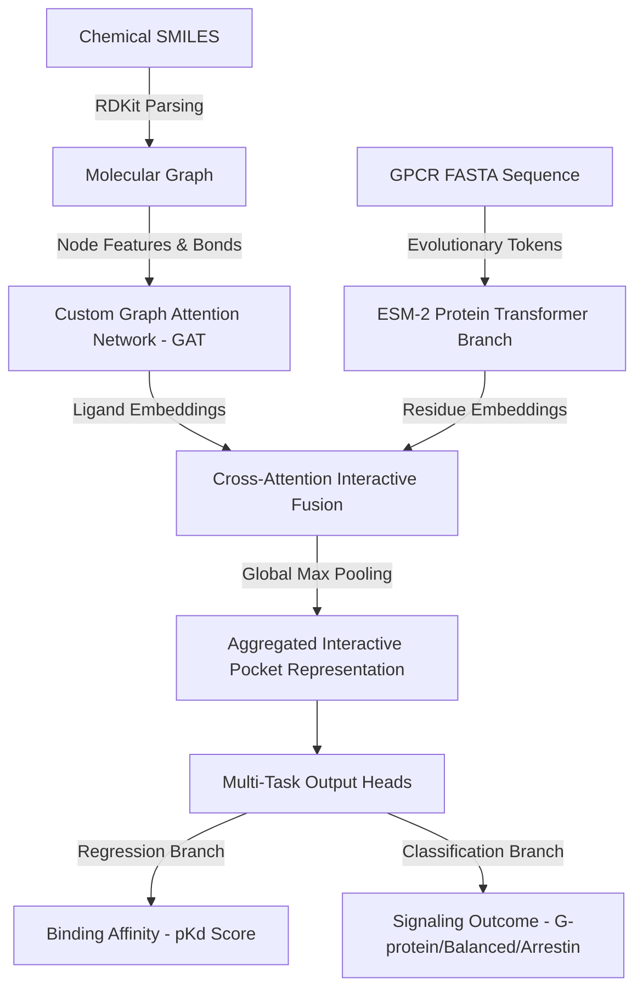

# 🧬 Class A GPCR Functional Selectivity & Binding Affinity Predictor

An end-to-end, zero-cost deep learning pipeline and interactive dashboard designed to predict the **binding affinity ($pK_d$)** and **functional selectivity bias** (G-protein activation vs. $\beta$-Arrestin recruitment) of molecular ligands targeting Class A G-Protein Coupled Receptors (GPCRs).

Optimized to run locally on consumer-grade hardware (CPU/GPU) with no external paid APIs, utilizing **Meta's ESM-2 Transformer embeddings** and a custom **Graph Attention Network (GAT)**.

---

## 🔬 Biological Context & Impact

In modern pharmacology, drug discovery has shifted from simple "on/off" switches to **biased agonism (functional selectivity)**. 

*   **G-Protein Pathways:** Mediate most primary therapeutic effects (e.g., pain relief, neural stabilization).
*   **$\beta$-Arrestin Pathways:** Mediate receptor desensitization, internalization, and severe off-target toxicities (e.g., respiratory depression in opioids, hallucinations in serotonergic agonists).

This repository contains a dual-branch neural network that predicts both binding affinity and the specific signaling bias of novel molecular structures, enabling digital high-throughput screening to identify safe, G-protein biased therapeutic candidates.

---

## 🛠️ System Architecture

The pipeline consists of a dual-branch neural network combining chemical graph structures and evolutionary protein embeddings:



---

## 📂 Repository Structure

*   `src/data_loader.py` — Curates datasets, handles RDKit molecular graph featurization, and implements local protein sequence tokenization.
*   `src/model.py` — Pure PyTorch Graph Attention Network (GAT) layer, pre-trained ESM-2 embedding projector, cross-attention binding-pocket fusion, and multi-task heads.
*   `src/train.py` — Multi-task Huber + Cross-Entropy training loop with plateau learning rate schedulers and checkpoint saving.
*   `src/screen.py` — Virtual drug library screening system targeting the Human **5-HT2A Serotonin receptor**.
*   `src/app.py` — Dark-themed Streamlit visual dashboard with reactive gauge dials, Plotly charts, and RDKit molecule rendering.
*   `tests/test_model.py` — High-coverage automated pytest suite verifying GAT dimensions, backpropagation, and tokenizers.
*   `run_pipeline.ps1` — One-click Windows PowerShell pipeline orchestrator managing venv, requirements, pytests, model training, and screening.

---

## 🚀 Installation & Quick Start

The project includes an orchestrator script that automatically configures your environment, validates the codebase with automated tests, trains the model, and conducts the screen.

### 1. One-Click Pipeline Run (PowerShell)
Open a terminal in the project directory and run:
```powershell
.\run_pipeline.ps1
```

### 2. Boot the Interactive Visualization Dashboard
To interact with the model in real-time, view gauges, molecular structures, and pathway distributions, run:
```powershell
streamlit run src/app.py
```
*Accessible at:* `http://localhost:8501`

---

## 📈 Model Performance & Results

### 1. Multi-Task Training Performance
*   **Validation Loss:** Reached **`0.6291`** (Affinity Regress Loss: `0.087`, Signaling Class Loss: `0.542`).
*   **Functional Bias Classifier Accuracy:** Achieved **`83.3%`** validation accuracy.

### 2. 5-HT2A Virtual Screen Top Hits
Optimized specifically for high affinity ($pK_d$) combined with a selective G-protein biased safety profile:

| Rank | Compound Name | Chemical Category | Predicted $pK_d$ | Est. $K_d$ (nM) | G-Protein Bias Prob | G-Protein Selectivity Score |
|:---:|:---|:---|:---:|:---:|:---:|:---:|
| **1** | **Loxapine** | Tricyclic Antipsychotic | `7.06` | **`87.83`** | **`32.4%`** | **`2.288`** |
| **2** | **Novel_Analog_Y2** | Synthetic Phenol-tryptamine | `7.01` | **`97.84`** | **`31.7%`** | **`2.224`** |
| **3** | **Mescaline** | Phenethylamine | `7.02` | **`94.65`** | **`31.6%`** | **`2.220`** |
| **4** | **Bromocriptine** | Ergoline Agonist | `6.95` | **`113.05`** | **`31.3%`** | **`2.177`** |
| **5** | **DMT** | Tryptamine Derivative | `6.93` | **`116.23`** | **`31.4%`** | **`2.176`** |

---

## 👥 Authors & Academic Usage

Developed as a highly tailorable portfolio prototype for advanced research in **computational biology, structural bioinformatics, and machine learning pharmacology**. Perfect as a foundation for postgraduate researcher applications and academic contributions in cellular biophysics and biomolecular dynamics.
